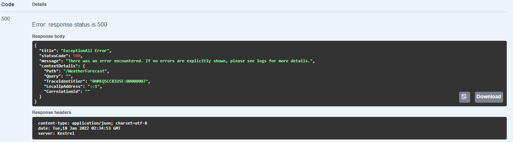
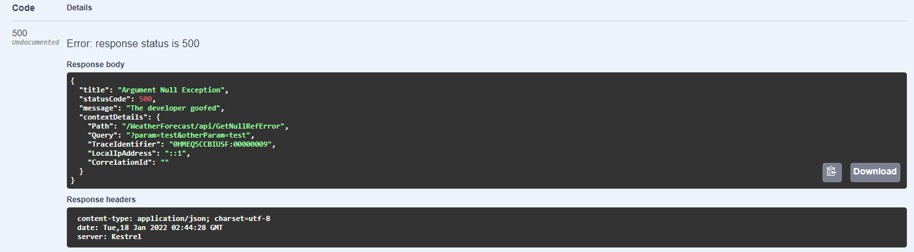
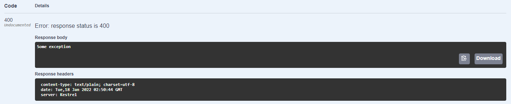
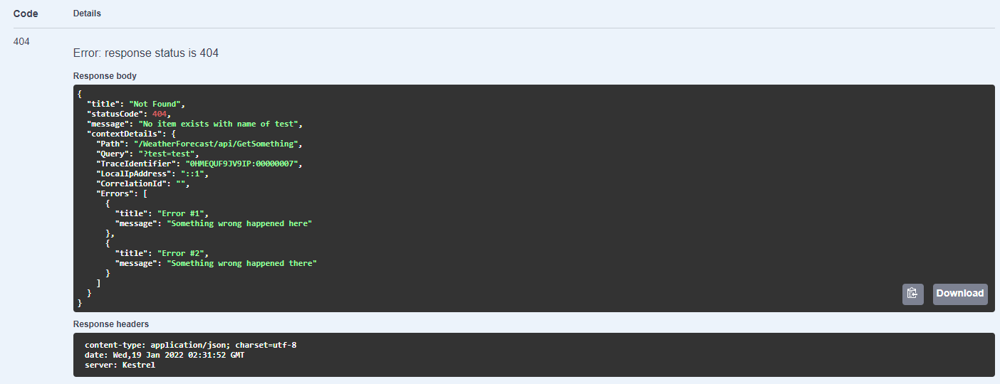
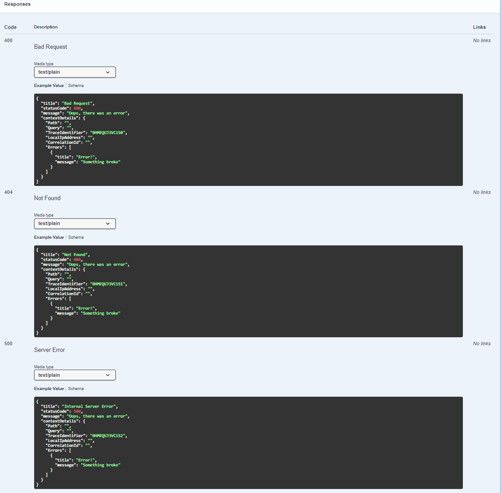

# ExceptionAll

| Package                          | Version                                                                                                                                   | Downloads                                                                                                                                  |
|----------------------------------|-------------------------------------------------------------------------------------------------------------------------------------------|--------------------------------------------------------------------------------------------------------------------------------------------|
| <b>ExceptionAll</b>              | [](https://www.nuget.org/packages/ExceptionAll/)                             | [](https://www.nuget.org/packages/ExceptionAll/)                           |
| <b>ExceptionAll.Abstractions</b> | [](https://www.nuget.org/packages/ExceptionAll.Abstractions/)   | [](https://www.nuget.org/packages/ExceptionAll.Abstractions/) |
| <b>ExceptionAll.Client</b>       | [](https://www.nuget.org/packages/ExceptionAll.Client/)               | [](https://www.nuget.org/packages/ExceptionAll.Client/)             |


## Table of Contents
  - [Summary](#summary)
    - [Features](#features)
  - [Understanding Exception Handling Middleware](#understanding-exception-handling-middleware)
    - [MVC Filters](#mvc-filters)
    - [Middleware](#middleware)
    - [Helpful Links](#helpful-links)
  - [Setup](#setup)
    - [Server Side](#server-side)
    - [Client Side](#client-side)
  - [Example Code](#example-code)
    - [Server](#server)
    - [Client](#client)
  - [Swagger Examples](#swagger-examples)
  - [Extending ExceptionAll](#extending-exceptionall)  


________
## Summary
ExceptionAll is a library for adding error handling middleware to .NET Core API solutions. Its goals are to reduce code noise by reducing the need for 'try-catch' blocks 
in code as well as provide a single source of responsibility for configuring and maintaining API error handling logic.

### Features
1. Allow for the customization of error response data and logging actions
   - Configuring logging and exception handling behaviors in Program.cs can become cluttered depending on the quantity or complexity of your logic. ExceptionAll provides an interface which allows developers to configure these features outside of Program.cs using a fluent API for ease of readability.
2. Reduce the amount of time needed to set up Swagger documentation
   - While setting up Swagger documentation can be simple, it can also be tedious. ExceptionAll assists developers by providing out of the box examples for which also updates alongside their custom configurations.
3. Simplify Http client serialization and deserialization
   - Handling 'try-catches' on HttpClient calls can potentially become 'noisy' if you need to use nested try-catches to try and reference variables for exception handling context. ExceptionAll creates a wrapper around the HttpClient interactions in order to provide developers error details in the ExceptionAll exception as to help provide clean code for the developer
4. Functionality supported in Minimal APIs
   - ExceptionAll aims to support developers regardless of their design decisions. It provides services (See MinimalApiExample.Api project) to support working with Minimal Apis. There are notes throughout the documentation stating if features/code methods are necessary for Minimal Apis. If the note states it is not supported, this just means the feature correlates to the MVC context.

-------
## Understanding Exception Handling Middleware
Global exception handling can be handled a multitude of ways whether it be using middleware or MVC filters. ExceptionAll's goal is to provide adaptable and modular code to fit your design needs. 
The following information is a summary of the links which has been provided to assist you in understanding which direction you may want to proceed with your error handling.

### MVC Filters
1. Only run for requests which have made it into the MVC context
2. Have access to MVC components (ModelState or IActionResults)
3. Can be applied to different levels of your code i.e. controller level or action level
4. Use if you want capture unhandled exceptions in your code

### Middleware
1. Only has access to the HttpContext and anything added by preceding middleware
2. Occurs before the MVC context becomes available in the pipeline
3. Can be used to catch exceptions outside of MVC context i.e. capturing errors in routing middleware

### Helpful Links
1. https://andrewlock.net/exploring-middleware-as-mvc-filters-in-asp-net-core-1-1/#:~:text=The%20main%20difference%20between%20them,anything%20added%20by%20preceding%20middleware.
2. https://stackoverflow.com/questions/42582758/asp-net-core-middleware-vs-filters
3. https://stackoverflow.com/questions/50887540/exceptionhandling-middleware-vs-filter-aspnetcore-webapi-2-1
_______
## Setup

### Server Side
1. Install ExceptionAll & ExceptionAll.Abstractions nuget packages
   1. Create an ExceptionAll configuration class which implements the <b>IExceptionAllConfiguration</b> interface. Below are some examples various examples but are not required
      1. ErrorResponses
           - A list of the types of error responses for specific error types encountered.
      2. ContextConfiguration
           - Allows the developer to extend the standard response object by adding details from the HttpContext. Options become limitless since custom headers are accessible. 
           - As the context properties are updated, the Swagger documentation should also be updated as well.
           - The 'Errors' key is reserved by ExceptionAll for the ContextConfiguration dictionary
           - Is nullable if you don't desire the functionality or additional properties
      3. ValidationLoggingAction
           - Logging action to occur during validation error in the MVC setup. *Does not work for Minimal APIs as of .NET 6*

   ```csharp
    public class ExceptionAllConfiguration : IExceptionAllConfiguration
    {
       public List<IErrorResponse> ErrorResponses => new()
       {
          ErrorResponse
           .CreateErrorResponse()
           .WithTitle("Argument Null Exception")
           .WithStatusCode(500)
           .WithMessage("The developer goofed")
           .ForException<ArgumentNullException>()
           .WithLogAction((x, e) => x.LogDebug(e, "Oops I did it again"))
       };

       public Dictionary<string, Func<HttpContext, object>> ContextConfiguration => new()
       {
           { "Path", x => x.Request.Path.Value ?? string.Empty },
           { "Query", x => x.Request.QueryString.Value ?? string.Empty },
           { "TraceIdentifier", x => x.TraceIdentifier },
           { "LocalIpAddress", x => x.Connection.LocalIpAddress?.ToString() ?? string.Empty },
           {
               "CorrelationId",
               x => x.Request.Headers["x-correlation-id"]
                     .ToString()
           }
       };

       public Action<ILogger, ActionContext> ValidationLoggingAction => (logger, context) =>
       {
           foreach (var (key, value) in context.ModelState)
           {
               foreach (var error in value.Errors)
               {
                   logger.LogWarning(error.Exception, "Error with {Key}: {Message}", key, error.ErrorMessage);
               }
           }
       };
    
   }
      ```

2. In Program.cs:

    ```csharp
    using ExceptionAll;

    var builder = WebApplication.CreateBuilder(args);
   
    builder.Services
           .AddExceptionAll<ExceptionAllConfiguration>()
   
           // Optional. Overrides default MVC validation error return.
           // Will execute logging upon error if configured in IExceptionAllConfiguration implementation
           // Not supported in Minimal APIs as of .NET 6
           .WithValidationOverride()
   
           // Optional. Adds a global MVC filter to all controllers. Only necessary if you aren't using ExceptionAll middleware or
           // if you don't desire to apply filters on a lower level i.e. controller or action. Not supported in Minimal APIs as of .NET 6
           .WithGlobalExceptionFilter()
   
           // Optional. Adds the default Swagger response examples. Not supported in Minimal APIs as of .NET 6
           .WithExceptionAllSwaggerExamples();
   
    var app = builder.Build(); 
   
    // Add for Minimal APIs or any context you'd like to handle errors outside of the MVC context
    app.UseMiddleware<ExceptionAllMiddleware>();
    ```

### Client Side
1. Install both ExceptionAll.Client & ExceptionAll.Abstractions nuget packages
2. Add the following code within your Program.cs file in order to inject the applicable services

   ```csharp
    using ExceptionAll.Client;
   
    builder.Services.AddExceptionAllClientServices();
    builder.Services.AddHttpClient();
    ```
    a. In client use, you will use 'IExceptionAllClientFactory' which is a wrapper around the standard .NET IHttpClientFactory interface. If clients are needed to be configured differently for different endpoints, simply add additional HttpClients with the applicable configurations.
_______
## Example Code

### Server
1. The default API response provided by ExceptionAll. This simulates an uncaught exception in your API code. This response will also be returned for specific exception types not initially considered during configuration.
   1. API Controller code
   
        ```csharp
            [HttpGet]
            public async Task<IActionResult> GetAll()
            {
                await Task.Delay(0);
                var rng = new Random();
                var result = Enumerable.Range(1, 5).Select(index => new WeatherForecast
                {
                    Date = DateTime.Now.AddDays(index),
                    TemperatureC = rng.Next(-20, 55),
                    Summary = Summaries[rng.Next(Summaries.Length)]
                }).ToArray();

                throw new Exception("This is simulating an uncaught exception");
            }
        ```
   2. Minimal API Code
      ```csharp
      var summaries = new[]
      {
         "Freezing", "Bracing", "Chilly", "Cool", "Mild", "Warm", "Balmy", "Hot", "Sweltering", "Scorching"
      };

      app.MapGet(
       "api/", () =>
       {
           var rng = new Random();
           var result = Enumerable.Range(1, 5)
                                  .Select(
                                      index => new WeatherForecast
                                      {
                                          Date         = DateTime.Now.AddDays(index),
                                          TemperatureC = rng.Next(-20, 55),
                                          Summary      = summaries[rng.Next(summaries.Length)]
                                      }
                                  )
                                  .ToList();

           throw new Exception("This is simulating an uncaught exception");

           return result;
       }
      )
      .Produces<ApiErrorDetails>(500);
      ```
   3. API Response
    
        

2. This example shows catching an exception configured in the configuration class. (See above configuration code)
   1. API Controller code
   
        ```csharp
         [HttpGet]
         [Route("api/GetNullRefError")]
         public async Task<IActionResult> GetNullRefError(string param, string otherParam)
         {
             param = null;
             await Task.Delay(0);
             throw new ArgumentNullException(nameof(param));
         }
        ```
   2. Minimal API
      ```csharp
      app.MapGet(
         "api/GetNullRefError", ([FromQuery] string param, [FromQuery] string otherParam) =>
         {
            param = null;
            throw new ArgumentNullException(nameof(param));
            return Results.Ok(param);
         }
      );
      ```
   3. API Response. The properties match what we see in our configuration, seen further up on the page.

       

3. There may be times where an ExceptionAll response is undesired. To get a non-ExceptionAll response, just wrap the controller/endpoint code with a standard 'try-catch' block and return the new, desired object.
   1. API Controller code
      ```csharp
       [HttpGet]
       [Route("api/GetWithoutExceptionAllError")]
       public async Task<IActionResult> GetWithoutExceptionAllError()
       {
           await Task.Delay(0);
           try
           {
               throw new Exception("Some exception");
           }
           catch (Exception e)
           {
               Console.WriteLine(e);
               return BadRequest(e.Message);
           }
       }
      ```
   2. Minimal API
      ```csharp
      app.MapGet(
         "api/GetWithoutExceptionAllError", () =>
         {
             try { throw new Exception("Some exception"); }
             catch (Exception e)
             {
                 Console.WriteLine(e);
                 return Results.BadRequest(e.Message);
             }
         }
      );
      ```
   3. API Response
   
        

4. This example covers manual response generation, for times developers want to return caught exceptions with a special message and/or a surface list of errors to the user
   1. API Controller code
      1. Make sure to inject the 'IActionResultService' into your controller constructor

      ```csharp
        public WeatherForecastController(ILogger<WeatherForecastController> logger,
            IActionResultService actionResultService)
        {
            _logger = logger ?? throw new ArgumentNullException(nameof(logger));
            _actionResultService = actionResultService ?? throw new ArgumentNullException(nameof(actionResultService));
        }

        [HttpGet]
        [Route("api/GetSomething")]
        [ProducesResponseType(typeof(BadRequestDetails), StatusCodes.Status400BadRequest)]
        [ProducesResponseType(typeof(NotFoundDetails), StatusCodes.Status404NotFound)]
        [ProducesResponseType(typeof(InternalServerErrorDetails), StatusCodes.Status500InternalServerError)]
        public async Task<IActionResult> GetSomethingWithQuery([FromQuery] string test)
        {
            await Task.Delay(0);

            var errors = new List<ErrorDetail>
            {
                new("Error #1", "Something wrong happened here"),
                new("Error #2", "Something wrong happened there")
            };

            return _actionResultService.GetResponse<NotFoundDetails>(
                ControllerContext,
                $"No item exists with name of {test}",
                errors);
        }
      ```
   2. Minimal API
      1. For Minimal Apis, make sure to inject IResultService instead of IActionResultService
      ```csharp
         app.MapGet(
             "api/GetSomething",
             (HttpContext context, [FromServices] IResultService resultService, [FromQuery] string test) =>
             {
                 var errors = new List<ErrorDetail>
                 {
                     new("Error #1", "Something wrong happened here"),
                     new("Error #2", "Something wrong happened there")
                 };
   
                 return resultService.GetResponse<NotFoundDetails>(
                     context,
                     $"No item exists with name of {test}",
                     errors
                 );
             }
         )
         .Produces<BadRequestDetails>(400)
         .Produces<NotFoundDetails>(404)
         .Produces<NotFoundDetails>(500);
      ```
   3. API Response
   
        

### Client
1. Make sure to inject the ExceptionAllClient factory wherever you are trying to make HttpClient calls
   ```csharp
   @inject IExceptionAllClientFactory _exceptionAllClientFactory
   ```
2. Create a HttpClient like you normally would. Two examples below
   ```csharp
   // Standard client creation
   IExceptionAllClient ExceptionAllClient = _exceptionAllClientFactory.CreateClient();
   
   // Creating named HttpClient configured in IOC
   IExceptionAllClient ClientWithHeader = _exceptionAllClientFactory.CreateClient("Test");
   ```
3. Execute one of the interface methods in order to call a http CRUD operation
_______

## Swagger Examples

The following objects are provided out of the box to provided to handle common API errors as well as give Swagger documentation examples.
1. BadGatewayDetails
2. BadRequestDetails
3. ConflictDetails
4. ForbiddenDetails
5. InternalServerErrorDetails
6. NotFoundDetails
7. NotImplementedDetails
8. RequestTimeoutDetails
9. ServiceUnavailableDetails
10. TooManyRequestDetails
11. UnauthorizedDetails
12. UnsupportedMediaTypeDetails

In order to provide the Swagger examples, add attributes with the return object as well as the HTTP status codes your endpoint handles.
<br/>

Note: Swagger examples are currently not support in Minimal Apis for .NET 6.

```csharp
    [HttpGet]
    [Route("api/GetSomething")]
    [ProducesResponseType(typeof(BadRequestDetails), StatusCodes.Status400BadRequest)]
    [ProducesResponseType(typeof(NotFoundDetails), StatusCodes.Status404NotFound)]
    [ProducesResponseType(typeof(InternalServerErrorDetails), StatusCodes.Status500InternalServerError)]
    public async Task<IActionResult> GetSomethingWithQuery([FromQuery] string test)
    {
        await Task.Delay(0);

        var errors = new List<ErrorDetail>
        {
            new("Error #1", "Something wrong happened here"),
            new("Error #2", "Something wrong happened there")
        };

        return _actionResultService.GetResponse<NotFoundDetails>(
            ControllerContext,
            $"No item exists with name of {test}",
            errors);
    }
```

The above code should give you the following Swagger response examples:



The Minimal API code will give an equivalent of the follow due to .NET 6 limitations for IExampleProvider in Minimal APIs


_______

## Extending ExceptionAll
ExceptionAll provides some standard detail objects out of the box, one of which is shown below. If you, as a developer, need to extend the library
and create additional detail types, follow the below example as a template and implement the IExceptionAllDetails interface on your custom object.

```csharp

public class BadGatewayDetails : BaseDetails
{
    public override (int StatusCode, string Title) GetDetails()
    {
        return (502, "Bad Gateway");
    }
}
```

To create a Swagger response example for the new object, create a class similar to the following. Utilize unit test libraries to mock a more detailed HttpContext, if desired.

```csharp
public class BadGatewayDetailsExample : IExamplesProvider<BadGatewayDetails>
{
    private readonly IContextConfigurationService _contextConfigurationService;

    public BadGatewayDetailsExample(IContextConfigurationService contextConfigurationService)
    {
        _contextConfigurationService = contextConfigurationService;
    }

    public BadGatewayDetails GetExamples()
    {
        return new BadGatewayDetails()
        {
            Message = "Oops, there was an error",
            ContextDetails = _contextConfigurationService.GetContextDetails(
                new DefaultHttpContext(),
                new List<ErrorDetail>
                {
                    new("Error!", "Something broke")
                })
        };
    }
}
```
